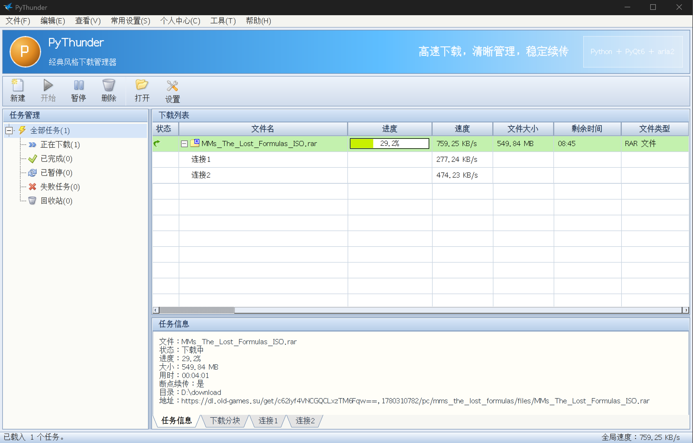

# PyThunder


PyThunder 是一个基于 `PyQt6 + aria2` 的跨平台桌面下载管理器项目，目标是复刻经典下载器的桌面交互体验，同时保持清晰、易扩展的 Python 架构。

当前版本已经具备可运行的 MVP 能力：

- 经典风格的桌面下载器界面
- 基于 `aria2c` 的下载核心
- SQLite 任务持久化
- 下载列表、状态栏、任务详情、分块视图、悬浮窗
- 可打包为不依赖本地 Python 的独立桌面程序

## 项目特点

- `PyQt6` 桌面 GUI，界面结构清晰，便于继续扩展
- 通过 `aria2 JSON-RPC` 控制下载任务
- UI、下载逻辑、存储层分离，方便后续维护
- 支持自动启动内置 `aria2c`
- 内置 `aria2c` 会绑定主程序生命周期，主程序退出或崩溃后自动停止
- 支持本地主题配置
- 支持打包 Windows / macOS / Linux 独立版本

## 技术栈

- Python 3.11+
- PyQt6
- requests
- SQLite
- aria2
- PyInstaller

## 快速开始

### 1. 安装依赖

```bash
python -m pip install -r requirements.txt
```

### 2. 准备 aria2 二进制

请将对应平台的 `aria2c` 放到以下目录之一：

- Windows: `resources/aria2/win/aria2c.exe`
- macOS: `resources/aria2/mac/aria2c`
- Linux: `resources/aria2/linux/aria2c`

说明：

- 没有 `aria2c` 时，程序界面仍可打开，但下载功能会提示不可用。
- 建议不要把第三方二进制直接提交到仓库，`.gitignore` 已默认忽略这些文件。

### 3. 启动项目

```bash
python main.py
```

## 已实现功能

- 启动主窗口并加载经典风格界面
- 新建 HTTP / HTTPS 下载任务
- 开始、暂停、删除任务
- 每秒轮询 aria2 任务状态
- 将任务记录持久化到 SQLite
- 打开下载文件所在目录
- 读取并展示下载分块信息
- 加载自定义主题配置

## 项目结构

```text
py_thunder/
├─ app/                 应用级配置、路径、主题、国际化
├─ core/                下载调度、aria2 RPC、任务模型
├─ services/            操作系统集成功能
├─ storage/             SQLite 初始化与任务仓储
├─ ui/                  主界面、侧边栏、任务表格、弹窗
├─ resources/           图标、主题、字体、aria2 二进制目录
├─ scripts/             打包和辅助脚本
├─ main.py              应用入口
├─ build.ps1            Windows 一键打包脚本
├─ build.sh             macOS / Linux 一键打包脚本
└─ requirements*.txt    运行与构建依赖
```

## 架构说明

项目当前采用分层结构：

```text
UI -> DownloadManager -> Aria2Client -> aria2c JSON-RPC
UI -> DownloadManager -> TaskRepository -> SQLite
```

这意味着：

- UI 不直接操作 aria2 或数据库
- 下载状态与数据存储由中间层统一协调
- 后续增加磁力链、BT、代理、限速等功能时更容易扩展

## 本地数据目录

程序会自动创建应用数据目录：

- Windows: `%APPDATA%/PyThunder`
- macOS: `~/Library/Application Support/PyThunder`
- Linux: `~/.local/share/PyThunder`

其中主要文件包括：

- `app.db`：任务数据库
- `config.json`：应用配置
- `theme.json`：用户主题覆盖配置

## 主题配置

默认主题文件位于：

- `resources/themes/classic_blue.json`

运行后，程序会在用户数据目录中生成：

- `theme.json`

你可以修改以下内容：

- 主窗口、工具栏、面板、侧边栏、状态栏颜色
- 任务状态颜色
- 进度条颜色
- 窗口尺寸
- 侧边栏宽度
- 表格行高
- 工具栏按钮尺寸
- 分块图尺寸

修改后重新启动程序即可生效。

## 打包发布

PyThunder 支持打包成不依赖本地 Python 环境的独立桌面程序，适合直接分发给最终用户。

### 安装打包依赖

```bash
python -m pip install -r requirements-build.txt
```

### Windows 一键打包

```powershell
.\build.ps1 -Mode portable -Clean
```

### macOS / Linux 一键打包

```bash
./build.sh portable --clean
```

### 通用打包命令

```bash
python scripts/build_release.py --mode portable --clean
```

### 打包模式说明

- `portable`：生成绿色版目录包，启动更快，适合实际分发
- `onefile`：生成单文件可执行程序，分发方便，但首次启动通常更慢
- `both`：同时生成两种版本

### 打包输出目录

```text
release/<platform>/
```

例如：

- `release/windows/portable/`
- `release/windows/PyThunder-windows-portable.zip`

### 跨平台打包说明

需要特别注意：

- Windows 机器本地只能直接打 Windows 包
- macOS 机器本地只能直接打 macOS 包
- Linux 机器本地只能直接打 Linux 包

如果你想一次性生成 `Windows + macOS + Linux` 三端产物，建议使用仓库里的 GitHub Actions 工作流：

- `.github/workflows/package.yml`

## 当前限制

- 当前仅包含 HTTP / HTTPS 下载任务创建
- 暂未支持磁力链接和种子文件下载
- aria2 RPC 目前是同步调用
- 设置页仍是占位实现
- 部分高级下载参数还未开放到 UI

## 后续规划

- Magnet 支持
- Torrent 文件支持
- BT 文件选择
- 代理设置
- 下载限速
- 剪贴板监听
- 系统托盘
- 浏览器扩展联动
- 更完整的设置页

## 适合协作开发的建议

首次克隆项目后，推荐这样开始：

```bash
python -m venv .venv
```

```bash
.venv\Scripts\activate
```

```bash
python -m pip install -r requirements.txt
python main.py
```

如果你在 macOS 或 Linux：

```bash
source .venv/bin/activate
python -m pip install -r requirements.txt
python main.py
```
